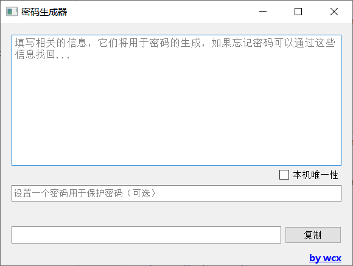
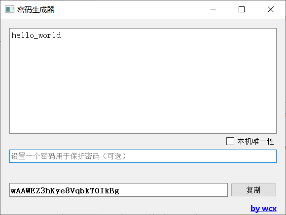
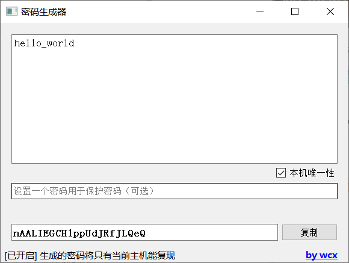
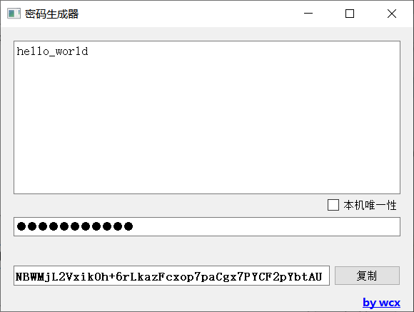

## 密码生成器
> 一个根据个人信息生成密码的工具（基于Qt/C++编写）

### 介绍
> 这个工具原理很简单，就是用hash和base64处理输入的信息，进行单向加密。通过你计算机的相关信息实现了不同电脑对于相同输入的信息所得到的密文是不一样的，这个功能你可以通过勾选“本机唯一性”开启。
>
> 你可以用这个工具根据一些易于记住的信息（比如：姓名、学校、网站地址、电话号码等等）来生成一个较复杂的密码。

### 效果

